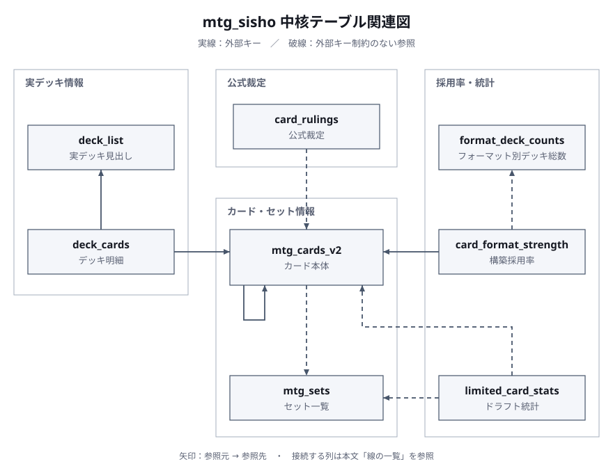

# データモデル（DATA_MODEL.md）

Sisho が読む PostgreSQL（18）のテーブル。列と型は実 DB の `information_schema` から 2026-08-23 に採取した。
行数は同日の概算。設計の考え方は末尾。

MCP の `query_mtg_database` はこれらを読み取り専用の役割（`readonly_ai`）で読む。
名前が二つあるカード（両面・出来事・分割 850 枚）は **面ごとの列**（`name_en_front/back`・`name_ja_front/back`）を正本とし、結合名 `card_name`／`japanese_name`／`name_display` は DB が自動で作る生成列（2026-08-31）。
プレイヤー名は開発側の `players` 表（`deck_list.player_id` で参照）に隔離し、公開側の DB には名前も ID も置かない（2026-08-31・`deck_list.player_name` 列は廃止）。

## 件数（2026-09-07 時点・README から移した）

| 種類 | 件数 | 出所 |
| --- | ---: | --- |
| カード | 31,843 枚（うち日本語名あり 30,731・日本語本文あり 30,412）＋ Arena 専用 887 枚（`digital` 列で区別・2026-08-31 合流・日本語名あり 857 枚） | Scryfall バルクデータ |
| 総合ルール | 条文 3,317＋用語集 739（2026-08-07 版） | Wizards of the Coast 配布の Comprehensive Rules |
| 公式裁定 | 77,960 件（2026-08-06 取得・重複 38 行を整理） | Scryfall rulings バルク（出典は Wizards 公式） |
| 実デッキ | 302,325 本（最新 2026-09-06） | MTGO 公式デッキリスト 284,617 本・MTGTop8 10,843 本・Moxfield（多人数統率者戦）4,134 本・MTGJSON（構築済み製品）2,731 本 |
| 採用率 | フォーマット別（Standard/Pioneer/Modern/Legacy/Vintage/Pauper/Premodern/Commander/Duel Commander ほか） | 上記の実デッキから再計算 |
| 共起 | 60 枚構築 809,108 組・統率者戦 2,143,267 組 | 同上 |
| リミテッド（ドラフト）統計 | 34 セット・10,509 行（セット×カードの勝率とピック順・2026-09-04 集計・表 `limited_card_stats`）＋色の組み合わせ・相性・ランク帯・ピック側の集計 5 表（`limited_color_stats` ほか） | 17Lands Public Datasets（CC BY 4.0）から派生した集計値 |

## 関連図（2026-09-17）

中核 8 表の関係。**実線は実在する外部キー、破線は外部キー制約が無く名前や識別子の一致で繋がる参照**。設計の考え方は末尾の節にある。

図の元は `assets/er_core_gen.py`（標準ライブラリだけの生成脚本）。箱の座標と折れ線の通り道がその中にあり、走らせると SVG と座標の検証結果を作り直す。

### 凡例
- **実線の矢印**: 実在する外部キー（全 7 本のうち中核 4 本を図示。残り 3 本の扱いは後述）。
- **破線の矢印**: 外部キー制約が無く、名前や識別子の一致で繋がる参照。

### 線の一覧

| 線 | 参照元 | 参照先 | 繋ぐ列 |
| --- | --- | --- | --- |
| 実線 | `mtg_cards_v2` | `mtg_cards_v2` | `rebalance_of`（原型カード） |
| 実線 | `deck_cards` | `deck_list` | `deck_id`（所属デッキ） |
| 実線 | `deck_cards` | `mtg_cards_v2` | `card_id`（解決済みカード） |
| 実線 | `card_format_strength` | `mtg_cards_v2` | `card_id`（集計対象カード） |
| 破線 | `mtg_cards_v2` | `mtg_sets` | `set_code`（代表印刷セット） |
| 破線 | `card_format_strength` | `format_deck_counts` | `format_name`（母数） |
| 破線 | `card_rulings` | `mtg_cards_v2` | `card_id` / `oracle_id` |
| 破線 | `limited_card_stats` | `mtg_cards_v2` | `db_card_name`（名前で照合） |
| 破線 | `limited_card_stats` | `mtg_sets` | `expansion`（収録セット） |

### 図から外したテーブルとその理由
本図では可読性を保つため中核の 8 表に絞り込み、以下のテーブルを図から除外しています。

#### 外部キーを持つが図から除外したテーブル（3 表）
- `edh_card_strength`: `mtg_cards_v2.id` への外部キー（ON DELETE CASCADE）を持ちますが、`card_format_strength` と同構造の統率者戦特化集計テーブルであり、関係モデルが重複するため割愛しました。
- `card_scope_deck_counts`: `mtg_cards_v2.id` への外部キー（ON DELETE CASCADE）を持ちますが、DATA_MODEL.md の 19 表一覧に含まれないスコープ別集計テーブルのため割愛しました。
- `players`: `deck_list.player_id` からの外部キー参照先ですが、開発側環境のみに存在するテーブルであり、公開データベースには含まれないため割愛しました。

#### 外部キーを持たないその他のテーブル（10 表）
- `mtg_cards_v2_nonlegal`: 非合法カードの退避用テーブルであり、`mtg_cards_v2` と同構造かつ外部キー・外部参照を持たないため。
- `mtg_rules`: 総合ルールの条文と用語集を保持するテーブルであり、他テーブルと結合を持たない独立データであるため。
- `card_cooccurrence`: 構築デッキから算出したカード名ペアの共起テーブルであり、派生集計の構造が重複するため。
- `edh_card_cooccurrence_v2`: `card_cooccurrence` と同趣旨の統率者戦向けカード ID ペア共起テーブルであり、派生集計の構造が重複するため。
- `mtgo_name_alias`: MTGO 固有のカード別名表示を正式名へ読み替える辞書テーブルであり、中核の参照構造から外れるため。
- `limited_color_stats`: リミテッドの色勝率集計テーブルであり、カード単位ではなくアーキタイプ（色の組み合わせ）単位の集計であるため。
- `limited_matchup_stats`: リミテッドの色相性集計テーブルであり、カード単位ではなく色同士のマッチアップ集計であるため。
- `limited_format_stats`: リミテッド環境指標集計テーブルであり、カード単位ではなくセット全体の環境統計であるため。
- `limited_card_rank_stats`: `limited_card_stats` をランク帯別に細分化した集計テーブルであり、参照関係が同一であるため。
- `limited_card_pick_stats`: `limited_card_stats` のピック指標に特化した集計テーブルであり、参照関係が同一であるため。

## テーブル一覧

| テーブル | 行数 | 役割 |
| --- | ---: | --- |
| `mtg_cards_v2` | 32,703 | カード本体。1 オラクル名 1 行。日本語名・日本語本文・合法性・導出列を持つ。うち 860 枚は `digital=true`（Arena 専用＝アルケミー・A- リバランス等・2026-08-31 合流）。紙のカードの照会は `WHERE NOT digital` |
| `mtg_cards_v2_nonlegal` | 1,919 | どのフォーマットでも合法でないカード（銀枠・playtest・Unknown Event 等）。同じ列構成で退避。Arena で合法な 860 枚は 2026-08-31 に `mtg_cards_v2` へ移した |
| `mtg_rules` | 4,056 | 総合ルール。条文 3,317＋用語集 739 |
| `card_rulings` | 77,998 | 公式裁定 |
| `deck_list` | 99,827 | 実デッキの見出し（出所・大会名・日付・順位・フォーマット） |
| `deck_cards` | 約 355 万 | デッキの中身（カード名・枚数・メイン/サイド/統率者） |
| `card_format_strength` | 約 1.0 万 | 60 枚構築の採用率（フォーマット別・そのカードを含むデッキ数） |
| `edh_card_strength` | 約 2.1 万 | 統率者戦・Duel Commander の採用率 |
| `format_deck_counts` | 10 | 採用率の分母（フォーマット別のデッキ総数） |
| `card_cooccurrence` | 約 59 万 | 60 枚構築の共起（カード名の組・出所別） |
| `edh_card_cooccurrence_v2` | 約 215 万 | 統率者戦の共起（card_id の組・出所別） |
| `mtgo_name_alias` | 158 | MTGO が別名で表示するカードの対応表（例: Superior Spider-Man を Kavaero, Mind-Bitten として表示） |
| `limited_card_stats` | 10,316 | リミテッド（ドラフト）のカード別統計。17Lands Public Datasets（CC BY 4.0）をセット×カードで集計（2026-08-31・33 セット） |
| `limited_color_stats` | 1,945 | リミテッドのセット×デッキの色の組み合わせ×タッチ有無の勝率（2026-09-02・32 セット。STX は元データに色の列が無く未収録） |
| `limited_matchup_stats` | 29,674 | リミテッドのセット×自分の色×相手の色の勝率（相性表・32 セット） |
| `limited_format_stats` | 224 | リミテッドのセット×ランク帯の環境指標（勝率・先手勝率・平均ターン数・マリガン数・33 セット） |
| `limited_card_rank_stats` | 69,139 | リミテッドのセット×ランク帯×カードの勝率（33 セット） |
| `limited_card_pick_stats` | 10,257 | リミテッドのセット×カードのピック側の指標（取られた回数・メイン投入率・取った人の平均勝ち数・33 セット） |
| `mtg_sets` | 1,048 | セット一覧（記号・名前・発売日・種別・Arena 専用か）。Scryfall の公開情報。リミテッド統計の「最新セット」の判定に使う（2026-09-03） |

## 列

### mtg_cards_v2

| 列 | 型 | 意味 |
| --- | --- | --- |
| `id` | integer | 主キー |
| `name_en_front` / `name_en_back` | text（front は NOT NULL） | **名前の正本（2026-08-31）**。表面と裏面の英語名。単面札は `back` が NULL。両面札（transform・adventure・split・modal_dfc・prepare・flip）は必ず 2 面 |
| `name_ja_front` / `name_ja_back` | text | 表面と裏面の日本語名。無い面は NULL（部分的に分かっている面はその面だけ入る）。`back` は `name_en_back` があるときだけ持てる（CHECK） |
| `name_ja_src_front` / `name_ja_src_back` | text | 日本語名の出所: `scryfall`（Scryfall の日本語印刷）・`manual`（手動補正表 `name_ja_manual`・出典 URL はそこに）・`rule_a`（A- リバランス札＝「A-」＋原型の日本語名）・`whisper`（2026-06〜07 に Wisdom Guild から取得した値）・`legacy`（出所を特定できない古い値） |
| `card_name` | text（生成列） | 英語の正式名 `表 // 裏`。`name_en_front || ' // ' || name_en_back` から自動で作る（一意索引つき）。手で書けない |
| `japanese_name` | text（生成列） | 日本語の正式名。単面札は `name_ja_front`。両面札は**両面の日本語が揃った時だけ** `表 // 裏`、片方でも無ければ NULL（部分値・二重は作れない） |
| `name_display` | text（生成列） | 表面の完成形 `《表の日本語名/表の英語名》`。表の日本語が無いとき、紙なら `英語名（日本語版なし）`、`digital` なら `英語名（日本語名未収録）`。裏面を指すときは `《name_ja_back/name_en_back》`（道具の返り値では `faces[].display`／`face_display`） |
| `digital` | boolean | Arena 専用のカードか（Vintage 非合法・historic 等で合法＝アルケミー・A- リバランス・Jumpstart: Historic Horizons 等）。既定 false。`search_mtg_cards` は Arena の形式を指定したときだけ digital を含める |
| `type_line` / `oracle_text` / `mana_cost` / `cmc` | text / text / text / numeric | タイプ行・本文・マナコスト・マナ総量 |
| `japanese_oracle_text` | text | 日本語の本文（公式訳のみ） |
| `colors` / `color_identity` / `produced_mana` | text[] | 色・固有色・生み出すマナ |
| `power` / `toughness` / `loyalty` | text | 数値でない表記（`*` など）があるので text |
| `rarity` / `layout` / `keywords` | text / text / text[] | 稀少度・レイアウト・キーワード能力 |
| `set_code` / `set_name` / `collector_number` / `set_codes` | text / text / text / text[] | 代表印刷のセットと番号・全印刷のセット一覧 |
| `card_faces_json` | jsonb | 両面・分割カードの面ごとの情報 |
| `legalities` | jsonb | フォーマット別の合法性（Scryfall の形） |
| `edhrec_rank` / `game_changer` | integer / boolean | EDHREC 人気順位・ゲームチェンジャー指定 |
| `tournament_score` | integer | 旧採用率指標（現行は `card_format_strength` を見る） |
| `face_cmcs` / `has_x` / `face_types` / `floor_cmc` | integer[] / boolean / text[] / numeric | 両面・分割の「唱えられる面」のコスト集合・X の有無・面ごとのタイプ・最小コスト |
| `front_keywords` | text[] | 表面だけの生得キーワード |
| `is_mana_boost` | boolean | マナ加速を本業とするか |
| `removal_types` / `removal` / `target_types` / `target` | text[] / jsonb / text[] / jsonb | 除去の種類と対象の構造化（本文から導出） |
| `draw_count` / `draw_x` | integer / boolean | ドロー枚数・X 枚ドローか |
| `tutor` / `dig` | jsonb | サーチ（ライブラリーから探す）と濾過（上から見る）の構造化 |
| `image_url` / `image_url_ja` | text | 画像 URL（英語版・日本語版） |
| `embed_text` | text | 前身（ベクトル検索）の名残。現行の道具は使わない |

### mtg_rules

| 列 | 型 | 意味 |
| --- | --- | --- |
| `rule_number` | text | 条番号（`702.19b` など）。用語集は見出し語 |
| `section` | integer | 章（1〜9） |
| `is_glossary` | boolean | 用語集の行か |
| `text_en` / `text_ja` | text | 英語原文・日本語訳（訳は未搬入で NULL） |
| `source_version` | date | 総合ルールの版の日付 |

### card_rulings

| 列 | 型 | 意味 |
| --- | --- | --- |
| `oracle_id` / `card_id` / `card_name` | uuid / integer / text | Scryfall のオラクル ID・`mtg_cards_v2.id`・英語名 |
| `source` | text | `wotc`（公式） |
| `published_at` | date | 裁定の公開日 |
| `comment` | text | 裁定本文（英語） |
| `source_version` | date | 取得したバルクの日付 |

### deck_list / deck_cards

| 列 | 型 | 意味 |
| --- | --- | --- |
| `deck_list.source` | text | 出所。`mtgo` `mtgo_pauper` `mtgo_vintage` `mtgo_other` `mtgo_edh`（MTGO 公式）・`mtgtop8` `mtgtop8_pauper` `mtgtop8_vintage` `mtgtop8_edh`・`moxfield_edh`・`mtgjson_precon` |
| `deck_list.format_name` | text | フォーマット名 |
| `deck_list.tournament_name` / `tournament_date` / `placement` / `tournament_event_id` | text / date / integer / integer | 大会名・日付・順位・出所側のイベント ID（重複判定の鍵） |
| `deck_list.archetype` / `bracket` | text / integer | アーキタイプ名（MTGTop8）・Moxfield のブラケット |
| `deck_list.source_url` / `created_at` | text / timestamp | 取得元 URL・取得時刻（UTC） |
| `deck_list.deck_name` / `set_code` | text / text | 構築済み製品の名前とセット |
| `deck_cards.deck_id` / `card_name` / `count` / `board` | integer / text / integer / text | デッキ・カード名（出所の表記のまま）・枚数・`main` `side` `commander` |
| `deck_cards.card_id` | integer | `mtg_cards_v2.id`。正規化マッチで後から埋める（`fix_deck_links.py`・未解決は NULL） |

### 採用率・共起

| テーブル | 列 | 意味 |
| --- | --- | --- |
| `card_format_strength` / `edh_card_strength` | `card_id` / `format_name` / `play_decks` | そのフォーマットでそのカードを含むデッキ数。分母は `format_deck_counts` |
| `format_deck_counts` | `format_name` / `total_decks` | フォーマット別のデッキ総数 |
| `card_cooccurrence` | `card_name_a` / `card_name_b` / `co_count` / `source` | 同じデッキに入った回数（名前の組・片方向格納・出所別） |
| `edh_card_cooccurrence_v2` | `card_id_a` / `card_id_b` / `deck_count` / `source` | 同上（統率者戦・card_id の組） |
| `mtgo_name_alias` | `mtgo_name` / `card_name` / `mtgo_id` / `set_code` / `note` | MTGO の表示名 → 正式名 |

### limited_card_stats（リミテッド統計・17Lands 集計）

主キーは (`expansion`, `event_type`, `card_name`)。用語は 17Lands の定義に合わせた（勝率は 17Lands ユーザーの対戦のみ＝全体勝率は 0.5 より高めに出る）。

| 列 | 型 | 意味 |
| --- | --- | --- |
| `expansion` | text | セット記号（例: `LCI`・`MSH`・`Cube_-_Powered`）。収録一覧は MCP の `describe_mtg_tables` が実測で返す |
| `event_type` | text | イベント種別。現在は `PremierDraft`（人間対面の Bo1 ドラフト）のみ。Quick Draft（ボット対面・Bo1）の公開データは 17Lands に無い（2026-09-02 調査・VOW 1 本を除く）ので、この表を Bo1 ドラフト一般の物差しとして使う。カードの強さ・色の勝率は同じ物差し、`alsa`／`ata` の流れ方だけは人間対面の値 |
| `card_name` | text | 17Lands 側のカード名（両面カードは表面名・稀に非 ASCII が `?` に化けている） |
| `db_card_name` / `match_kind` / `in_cards_v2` | text / text / boolean | `mtg_cards_v2.card_name` への対応（`exact`＝完全一致・`front`＝表面名で一致・`mojibake`＝`?` を非 ASCII 一文字として一意に復元・`none`＝無し＝Arena 専用札など）。カードを名指しするときは `db_card_name` を使う |
| `gih_games` / `gih_wins` / `gih_wr` | integer / integer / numeric(6,4) | Games In Hand: 手札に来た（初手＋引いた）ゲーム数・勝ち数・勝率 |
| `oh_games` / `oh_wins` / `oh_wr` | 同上 | Opening Hand: 初手にあったゲーム |
| `gd_games` / `gd_wins` / `gd_wr` | 同上 | Games Drawn: 引いたゲーム（初手を除く） |
| `gp_games` / `gp_wins` / `gp_wr` | 同上 | Games Played: メインデッキに入っていたゲーム |
| `seen_packs` / `alsa` | integer / numeric(6,2) | 見えたパック数と Average Last Seen At（パック内で最後に見えたピック番号の平均・1 始まり・小さいほど早く消える） |
| `taken_count` / `ata` | integer / numeric(6,2) | 取られた回数と Average Taken At（取られたピック番号の平均・1 始まり） |
| `computed_at` | timestamptz | 集計した時刻 |

### 17Lands 追加集計 5 表（2026-09-02）

出典は `limited_card_stats` と同じ 17Lands Public Datasets（PremierDraft）。`wr` などの勝率・平均の列は生成列（分子と分母から自動計算・公開サーバー側で同じ式を持つ）。ランク帯 `rank` は `bronze`〜`mythic` の小文字（元データの `Platinum-4-0-0-0` 形式は先頭の帯だけに揃えた・欠けは `none`）。

| 表 | 主キー | 主な列 |
| --- | --- | --- |
| `limited_color_stats` | (`expansion`, `event_type`, `main_colors`, `splash`) | `games` / `wins` / `wr`。`main_colors` は `WU` のような色の並び・`splash` はタッチ有無 |
| `limited_matchup_stats` | (`expansion`, `event_type`, `main_colors`, `opp_colors`) | `games` / `wins` / `wr`。相手の色は対戦中に見えた色 |
| `limited_format_stats` | (`expansion`, `event_type`, `rank`) | `games` / `wins` / `wr` / `on_play_games` / `on_play_wins` / `on_play_wr`（先手勝率）/ `turns_sum` / `avg_turns` / `mulligans_sum` |
| `limited_card_rank_stats` | (`expansion`, `event_type`, `rank`, `card_name`) | `gih_games` / `gih_wins` / `gih_wr` / `gp_games` / `gp_wins` / `gp_wr` / `db_card_name` |
| `limited_card_pick_stats` | (`expansion`, `event_type`, `card_name`) | `picks` / `maindeck_rate` / `sideboard_in_rate` / `event_wins_sum` / `event_losses_sum` / `event_picks` / `avg_event_wins` / `db_card_name` |

### 確率計算の SQL 関数（2026-09-04）

`sql/prob_functions.sql`。超幾何分布の厳密値を `numeric` で返す（IMMUTABLE・6 桁）。論理レプリケーションは関数を運ばないので、開発側と公開サーバーの両方で流す（`CREATE OR REPLACE`・冪等）。MCP の `mtg_probability` はこれを呼ぶ薄い入口で、`query_mtg_database` からはデータと結合して直接呼べる。

| 関数 | 意味 |
| --- | --- |
| `mtg_comb(n, k)` | 組み合わせ C(n, k) |
| `mtg_hypergeom_exact(N, K, D, m)` / `mtg_hypergeom_atleast(N, K, D, m)` | N 枚中 K 枚の当たりから D 枚引いて、当たりがちょうど m 枚／m 枚以上 |
| `mtg_cards_seen(turn, on_play, mull)` | turn ターン目までに見る枚数（初手 7−mull＋引き。先手は turn−1 回・後手は turn 回） |
| `mtg_prob_by_turn(deck, copies, turn, on_play, m, mull)` | turn ターン目までに copies 枚入りの札を m 枚以上引く |
| `mtg_land_drops(deck, lands, turn, on_play, mull)` | turn ターン目まで毎ターン土地を置ける（見た札に土地が turn 枚以上） |
| `mtg_combo_by_turn(deck, a, b, turn, on_play, mull)` | turn ターン目までに A と B を両方 1 枚以上引く（包除） |

例: `SELECT mtg_land_drops(60, 24, 4, true)` → 0.631785。試験は `tests/test_probability.py`（`math.comb` の独立実装を黄金値にする）。

## 設計の考え方

- **1 対 1 の属性は列に昇格し、別テーブルに分けない。** 汎用の key-value は複合条件で自己結合が増えるので採らない。
- **生データは JSONB で保持し、よく使う属性だけ列に昇格**（`legalities`・`card_faces_json`）。
- **デッキとカードの多対多は中間テーブルで正規化**（`deck_list`—`deck_cards`—`mtg_cards_v2`）。`card_id` は後から埋める（非破壊）。
- **不在は NULL。番兵値は置かない。** 導出列は冪等な便で作り直す（値が変わる行だけ UPDATE）か、生成列（`name_display`）にする。
- **合法/非合法を分ける**（`*_nonlegal` へ退避）。検索の母集団は合法側だけ。
- **日本語は公式訳だけ。** 公式和訳が無いカードに非公式訳が混じっていたことが過去にあり（831 件）、「日本語名なし・日本語本文あり」の組を指紋にして除去した。
- **MTGO の大会は MTGO 公式を正とし、MTGTop8 は紙の大会担当。** MTGTop8 に転載された MTGO の大会は、MTGO 公式が覆う期間だけ採用率・共起の集計から外す（全期間で外すと分母が 3 割落ちる）。
